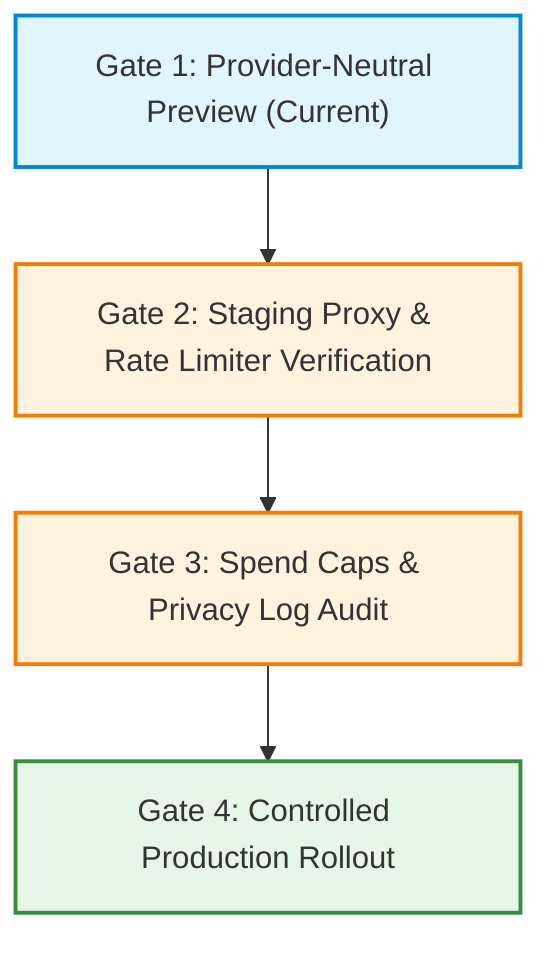

# Dream Image Studio Deployment Boundary & Proxy Architecture (Draft)

**Document Version:** 1.0.0 (Draft)  
**Updated:** 2026-10-09  
**Scope:** Architecture and deployment checklist for the future provider-neutral Dream Image server proxy.  
**Constraint:** Vendor-neutral specification; no vendor selection, no credentials added, and production disabled by default.  
**Associated Task:** H-108 / H-109  

---

## 1. Executive Summary & Privacy Principles

DreamAlchemy's Dream Image Studio provides contemplative visual reflections inspired by dream themes. To preserve user trust and protect vulnerable subconscious personal narratives, all visual reflections must adhere to strict architectural privacy boundaries:

1. **Curated Scene Catalog Only:** Image generation requests must be strictly constrained to curated catalog scenes. Raw personal dream journal narratives, voice recordings, diary entries, and personal reflections **never leave the device**.
2. **Provider-Neutral Serverless Proxy:** Mobile and web clients communicate exclusively with an application-owned serverless proxy route (e.g., `/api/dream-image`). The client never receives or stores third-party provider credentials.
3. **Minimal Remote Retention Target:** The application proxy must not create user accounts or a permanent image database. Provider and delivery retention must be reviewed explicitly; short-lived signed URLs and documented automatic expiry are release requirements, not assumptions about a future vendor.
4. **Disabled-by-Default Rollout:** The feature remains inactive (`DREAM_IMAGE_FEATURE_ENABLED=false`) until security, moderation, rate limiting, and spending controls are fully verified.

---

## 2. Server-Side Security & Proxy Architecture

### 2.1 Server-Only Secrets & Environment Variables

| Variable Name | Exposure | Required Default | Purpose |
| :--- | :--- | :--- | :--- |
| `DREAM_IMAGE_FEATURE_ENABLED` | Server-only | `false` | Master kill-switch. When `false` or unset, the proxy immediately returns HTTP 503 (`provider_unavailable`). |
| `DREAM_IMAGE_API_KEY` | Server-only | *Unset / Secret* | Upstream image provider authentication key. Must never be exposed to clients or committed to source control. |
| `DREAM_IMAGE_API_URL` | Server-only configuration | *Unset* | Upstream image generation endpoint URL. It is not a credential, but should remain out of client configuration so clients call only the application-owned proxy. |
| `DREAM_IMAGE_RATE_LIMIT_SECRET` | Server-only | *Unset / Secret* | HMAC key used to anonymize client network identifiers for durable rate limiting. |

> **Critical Rule:** Never prefix provider secrets with `EXPO_PUBLIC_`. The client application must only know its own backend proxy origin (`EXPO_PUBLIC_API_BASE_URL`).

---

## 3. Proxy Boundary & Verification Checklist

### 3.1 Curated-Prompt Allowlisting & Input Sanitization
- [ ] **Catalog Prompt Allowlist:** The server proxy must validate incoming `visualReflectionPrompt` strings against an allowlist of known catalog templates (`DREAM_IMAGE_PROMPT_TEMPLATES`).
- [ ] **Rejection of Freeform & Raw Dream Text:** Any request containing freeform text, unapproved prompt variations, or personal narrative markers must be immediately rejected with HTTP 400 (`invalid_prompt`).
- [ ] **Strict Style Validation:** The `style` property must strictly match one of the four supported enum values: `'ethereal' | 'surreal' | 'watercolor' | 'cinematic'`.
- [ ] **Payload Sanitization:** The proxy must reject incoming payloads containing unexpected top-level fields (e.g., `dreamId`, personal names, user IDs, dates, or dream analysis tags).
- [ ] **Body Size Limits:** Enforce a strict request body ceiling (e.g., max 16 KB) and require `Content-Type: application/json`.

### 3.2 Content Moderation & Upstream Safety Pipeline
- [ ] **Two-Tier Safety Filter:**
  1. *Tier 1 (Proxy Pre-Flight):* Exact curated-template/style allowlisting and unexpected-field rejection. Do not rely on regexes to identify names, locations, or other personal data reliably.
  2. *Tier 2 (Upstream Provider Moderation):* Upstream provider safety check executed prior to final rendering.
- [ ] **Standardized Error Mapping:** If a prompt triggers moderation filters, the proxy must return HTTP 422 with stable error code `moderation_rejected` without leaking provider debug payloads.
- [ ] **Non-Diagnostic Guarantee:** Safety pipeline must verify that prompt modifications do not inject medical, psychological, or diagnostic terminology.

### 3.3 Durable Request Throttling & Cost Controls
Due to the high cost of generative image models, strict rate limiting is essential to prevent abuse and denial-of-wallet attacks:
- [ ] **Anonymous HMAC Network Identifiers:** Hash client IP/network signatures with `DREAM_IMAGE_RATE_LIMIT_SECRET`. Never store raw IP addresses or link identifiers to user accounts.
- [ ] **Durable Storage Backend:** Store rate-limit counters in a durable, low-latency key-value store with an expiry window. Per-instance memory is not sufficient for serverless enforcement.
- [ ] **Per-Client Quotas:** Define, document, and test conservative anonymous quotas based on the selected provider's costs and abuse model before enablement.
- [ ] **HTTP 429 & Retry-After:** When the quota is exceeded, return HTTP 429 (`rate_limited`) with a standard `Retry-After: <seconds>` header.
- [ ] **Provider Spending Caps & Alerts:** Configure hard monthly budget caps and daily spend alerts in the upstream provider account console.

### 3.4 Transient Image Retention & CDN Hosting
- [ ] **Short-Lived Signed URLs:** Generated image assets should be served via temporary signed URLs with a reviewed, documented time-to-live.
- [ ] **Automated Ephemeral Caching:** If images are temporarily cached on an edge CDN, assets must purge automatically within the privacy-policy retention window.
- [ ] **No Cloud User Association:** DreamAlchemy does not maintain user accounts or cloud databases. Image files must never be tagged with user identity or synced to remote user profiles.
- [ ] **Local Device as User-Controlled Store:** Future save functionality may write a user-selected copy locally. Local deletion must remove the app-managed copy, clearly distinguish Photos-library copies, and cannot claim to retract provider/CDN data outside documented retention controls.

### 3.5 Privacy-Safe Logging & Observability
- [ ] **Allowed Log Fields:**
  - Unique Request UUID
  - Coarse outcome status (`success` | `moderation_rejected` | `rate_limited` | `upstream_error`)
  - HTTP response code
  - Execution latency / duration (ms)
- [ ] **Strict Logging Ban:**
  - **NEVER LOG** prompt text or scene descriptions.
  - **NEVER LOG** client IP addresses (only the one-way HMAC hash may be used transiently for rate limits).
  - **NEVER LOG** generated image URLs or image binary data.
  - **NEVER LOG** authorization headers, tokens, or provider API keys.
  - **NEVER LOG** personal dream journal narratives or dream IDs.

### 3.6 Accessibility Metadata Quality
- [ ] **Mandatory Descriptive Alt Text:** Every successful image generation response must include descriptive alternative text (`altText`).
- [ ] **Project Heuristic:** Alt text must pass `isDescriptiveAltText()` verification, followed by manual screen-reader/content review; the heuristic alone is not a WCAG conformance determination:
  - Must not be empty or generic (e.g., rejecting `"image"`, `"dream art"`, `"artwork"`).
  - Must not be a raw file name or URL (e.g., rejecting `"image_123.png"`).
  - Must convey scene subject, artistic medium/style, atmospheric lighting, and color palette.
- [ ] **Incomplete Response Rejection:** If the upstream provider fails to return valid alt text, the proxy must fall back to the pre-composed catalog alt text template (`getAltTextForTemplate`) or return an error.

### 3.7 iOS Photo Permission Configuration
When implementing the client-side "Save Image to Device" action (`saveLocally`), configure iOS permissions adhering to Apple's least-privilege principles:

- [ ] **Use Add-Only Permission (`NSPhotoLibraryAddUsageDescription`):**
  ```xml
  <key>NSPhotoLibraryAddUsageDescription</key>
  <string>Dream Alchemy needs permission to save your generated dream reflection artwork directly to your Photos library.</string>
  ```
- [ ] **Avoid Full Photo Library Access:** Use add-only write permissions where possible on iOS 14+ so that DreamAlchemy never requests or receives read access to the user's personal photo library.
- [ ] **Zero Personal Metadata Injection:** When saving the image file to the local camera roll, ensure dream journal narratives, reflections, tags, dream timestamps, and identifiers are **never embedded into EXIF or image metadata**.

---

## 4. Phased Rollout & Deployment Gates



### Gate 1: Provider-Neutral Preview (Current Phase)
- `EXPO_PUBLIC_DREAM_IMAGE_API_URL` remains unset.
- App displays the "Preview Mode / Image Service Unavailable" notice.
- Users can browse curated scenes, explore styles, and inspect alt text previews offline.
- Zero network requests leave the device.

### Gate 2: Staging Proxy & Rate Limiter Verification
- Deploy serverless proxy to a staging/Preview environment.
- Verify allowlist rejection on arbitrary user prompts.
- Verify rate limiting triggers HTTP 429 when quota is exceeded.
- Confirm upstream timeout aborts after 60 seconds.

### Gate 3: Spend Caps & Privacy Log Audit
- Set owner-approved provider hard budget limits and active billing alerts based on the chosen plan and test cohort.
- Execute full test suite against staging proxy; inspect server logs to verify zero prompts or PII are logged.
- Perform manual descriptive-alt-text review on all test responses in addition to the project heuristic.

### Gate 4: Controlled Production Rollout
- Set `DREAM_IMAGE_FEATURE_ENABLED=true` on production only after every required Gate 1–3 check has recorded evidence.
- Keep the server-side feature flag operational so the proxy can return to its disabled state if upstream anomalies occur.
