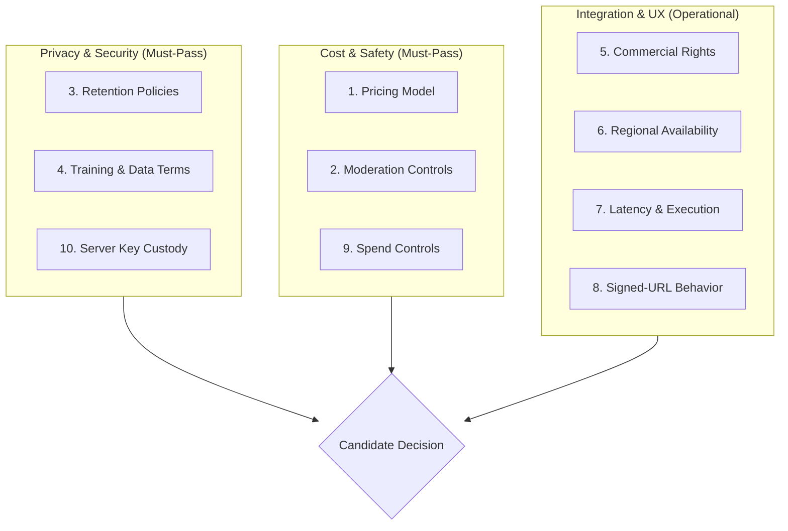

# Dream Image Provider Evaluation Template (Vendor-Neutral)

**Document Version:** 1.0.0  
**Updated:** 2026-10-09  
**Scope:** Standardized vendor-neutral evaluation framework and candidate assessment worksheet for prospective generative image providers for Dream Image Studio.  
**Mandate:** Strictly vendor-neutral. Does not recommend, select, or benchmark any commercial vendor. Preserves all privacy, offline-first, and server-only proxy boundaries established in `docs/DREAM_IMAGE_DEPLOYMENT_BOUNDARY_DRAFT.md`.  
**Associated Tasks & Blockers:** H-110; prerequisite for resolving `BLK-IMG-01` in `docs/DREAM_IMAGE_MAC_TEST_MATRIX.md`.

---

## 1. Executive Summary & Evaluation Principles

DreamAlchemy's Dream Image Studio provides contemplative visual reflections inspired by Jungian dream themes and archetypes. To preserve user trust and protect vulnerable subconscious personal reflections, any prospective image generation provider must satisfy rigorous architectural, privacy, security, and economic standards.

### 1.1 Non-Negotiable Architectural Boundaries
Before evaluating commercial terms or latency, any candidate provider must be compatible with DreamAlchemy's core architectural tenets:
1. **Curated Scene Catalog Only:** Image generation requests are strictly constrained to curated catalog scenes (`DREAM_IMAGE_PROMPT_TEMPLATES`). Raw personal dream journal narratives, reflections, tags, voice transcripts, and personal identifiers **never leave the device**.
2. **Provider-Neutral Serverless Proxy:** Mobile and web clients communicate exclusively with DreamAlchemy's serverless proxy route (`/api/dream-image`). The client never receives, stores, or utilizes third-party provider credentials.
3. **Minimal Remote Retention Target:** Neither the proxy nor the provider may establish permanent remote user accounts or persistent dream-associated image databases. Remote delivery must use short-lived, transient signed URLs with documented automated purging.
4. **No Undisclosed Model Training:** Provider terms must clearly state whether API inputs or outputs are used for training, fine-tuning, evaluation, or human review. Any opt-out or contractual exclusion must be verified before testing.
5. **Enforceable Cost Controls:** Provider and DreamAlchemy proxy controls together must enforce an owner-approved budget and request ceiling to reduce denial-of-wallet risk.
6. **Disabled-by-Default Rollout:** The feature remains inactive (`DREAM_IMAGE_FEATURE_ENABLED=false`) until candidate evaluation, proxy validation, and phased rollout gates are satisfied.

---

## 2. Evaluation Dimensions & Compliance Criteria

Every candidate provider must be evaluated across the following 10 objective dimensions. Each dimension specifies the evaluation criteria, required standards, and failure thresholds.

---

### Dimension 1: Pricing Model & Unit Economics
*Assesses predictable unit costs, resolution tiers, billing structure, and platform commitments.*

* **Key Assessment Questions:**
  1. What is the unit billing metric (per-image request, resolution tier, inference step count, compute time)?
  2. Is pricing deterministic per generation, or does it vary based on server demand, inference iterations, or output size?
  3. Are there mandatory monthly platform fees, seat licenses, or minimum spend commitments?
  4. What is the currency denomination and payment structure (prepaid credit balance vs. postpaid monthly invoicing)?
  5. Are there surcharges for higher concurrency, peak-hour usage, or prioritized inference queues?
* **Compliance Standards:**
  * **Pass:** Transparent per-generation or bounded-compute pricing that can be modeled against the documented pilot budget; prepaid credit or predictable invoicing; no pilot commitment above the owner-approved ceiling.
  * **Conditional:** Dynamic or compute-second pricing that requires proxy-side token/time caps; invoiced billing with verified hard spending limit.
  * **Fail:** Opaque pricing, unbounded surge charges, commitments above the approved pilot budget, or billing that cannot be capped through provider or proxy controls.

---

### Dimension 2: Content Moderation & Upstream Safety Controls
*Assesses automated pre- and post-generation safety screening, policy enforcement, and machine-readable rejection error mapping.*

* **Key Assessment Questions:**
  1. Does the provider include automated pre-generation prompt screening (filtering harmful, illegal, sexual, violent, or self-harm content)?
  2. Does the provider inspect the generated visual output before delivery to prevent unexpected hazardous imagery?
  3. How are moderation rejections communicated via the API? Are machine-readable, stable error codes returned (e.g., `moderation_rejected`, `policy_violation`) or generic HTTP 400/500 errors?
  4. Can safety filtering sensitivity be adjusted, or can custom keyword/concept blocklists be supplied?
  5. What is the failover behavior if the moderation subsystem times out or is unreachable (fail-closed vs. fail-open)?
* **Compliance Standards:**
  * **Pass:** Multi-modal pre- and post-generation safety filtering; clear machine-readable rejection error codes that cleanly map to DreamAlchemy's `moderation_rejected` public error code; strict fail-closed policy.
  * **Conditional:** Pre-generation text moderation only, requiring proxy-side post-render heuristic checks; generic error codes that require response payload parsing.
  * **Fail:** No automated moderation; fail-open moderation behavior on error; error responses that echo raw prohibited content back into client logs.

---

### Dimension 3: Input & Output Retention Policies
*Assesses data persistence duration on provider infrastructure, logging practices, and explicit deletion mechanisms.*

* **Key Assessment Questions:**
  1. How long are input prompts stored in provider operational logs, temporary caches, or analytical telemetry?
  2. How long are generated output images stored on provider object storage or CDN servers?
  3. Does the provider offer an explicit deletion API to purge stored prompts and generated assets immediately upon request?
  4. Are prompt inputs accessible to human reviewers, contractors, or support personnel?
  5. Does the provider allow zero-retention or transient-only processing modes for API customers?
* **Compliance Standards:**
  * **Pass:** Documented minimal retention within the project's reviewed privacy window, restricted operational access, expiring delivery URLs, and a deletion mechanism or automatic purge commitment.
  * **Conditional:** Longer abuse-monitoring retention or limited human review under documented access controls, requiring explicit privacy review and user disclosure.
  * **Fail:** Indefinite storage of prompts or generated images; public browsing galleries of customer generations; human inspection of prompts without opt-out.

---

### Dimension 4: Training & Data-Use Terms
*Assesses contractual guarantees that customer inputs and outputs are never utilized for model training or evaluation.*

* **Key Assessment Questions:**
  1. Do the provider's standard API Terms of Service explicitly prohibit using customer inputs (prompts) to train, retrain, fine-tune, or align future foundation models?
  2. Are generated output images excluded from foundation model training sets, benchmark datasets, or marketing showcases?
  3. Is the training exclusion default for all API traffic, or does it require an explicit opt-out toggle, enterprise tier, or signed Data Processing Agreement (DPA)?
  4. Does the provider share customer prompts or images with third-party sub-processors, researchers, or external partners?
* **Compliance Standards:**
  * **Pass:** Standard API terms or standard DPA explicitly exclude all customer inputs and outputs from model training, fine-tuning, and research by default.
  * **Conditional:** Zero-training guarantee requires submitting a standard online opt-out form or configuring an account-level API privacy toggle (must be verified prior to testing).
  * **Fail:** Terms of service claim a license to use customer inputs or outputs for model training, improvement, or promotional purposes without a complete, binding opt-out.

---

### Dimension 5: Commercial Output Rights & Licensing
*Assesses intellectual property ownership, redistribution rights, watermarking requirements, and usage restrictions.*

* **Key Assessment Questions:**
  1. Does the customer/end-user retain full ownership or an unencumbered commercial license to generated images?
  2. Does the license permit end-users to view, download, save to device photo libraries, and share their reflections?
  3. Does the provider mandate visible watermarks, platform logos, or public user-facing attribution (e.g., "Generated by X")?
  4. Does the provider embed invisible provenance metadata (e.g., C2PA, SynthID)? Does the metadata avoid leaking personal data, user tokens, or session IDs?
  5. Are there restrictive use-case covenants that prohibit creative arts, contemplative apps, or dream journaling applications?
* **Compliance Standards:**
  * **Pass:** Sufficient commercial display, download, and sharing rights granted to DreamAlchemy users; provenance metadata (if present) contains only model provenance and no personal identifiers; clear allowance for contemplative/artistic mobile applications.
  * **Conditional:** Non-exclusive commercial license with attribution required only in developer documentation/settings (not on user-generated images).
  * **Fail:** Provider retains ownership of output; mandatory visible watermarking on user imagery; restrictions preventing mobile app display or photo library export.

---

### Dimension 6: Regional Availability, Data Residency & SLAs
*Assesses datacenter geographic distribution, GDPR compliance, latency by region, and availability commitments.*

* **Key Assessment Questions:**
  1. In which geographic regions and cloud datacenters are inference and storage hosted?
  2. Does the provider support EU/UK data residency or offer Standard Contractual Clauses (SCCs) for GDPR compliance?
  3. What is the historic and guaranteed service availability SLA (e.g., 99.5%, 99.9%)?
  4. Does the provider maintain a public status page with incident history, uptime metrics, and automated alert subscriptions?
  5. What is the geographical latency profile across North America, Europe, and Asia-Pacific?
* **Compliance Standards:**
  * **Pass:** Availability commitment appropriate to the pilot, a public status channel, transparent processing regions, and applicable privacy terms/DPA support.
  * **Conditional:** No contractual SLA or limited regional processing, with acceptable observed reliability and reviewed cross-border safeguards.
  * **Fail:** Frequent unannounced outages; no public status tracking; lack of GDPR compliance or refusal to sign standard data protection agreements.

---

### Dimension 7: Latency Profile & API Execution Model
*Assesses generation turnaround time, synchronous vs. asynchronous execution, serverless timeout compatibility, and concurrency.*

* **Key Assessment Questions:**
  1. What is the API interaction model:
     * **Synchronous:** HTTP POST blocks until generation finishes, returning image URL/data directly.
     * **Asynchronous:** HTTP POST returns a job ID; client polls GET `/jobs/{id}` or provides a webhook callback URL.
  2. What is the typical turnaround latency distribution (p50, p90, p99) for standard image sizes (1024x1024)?
  3. Does turnaround latency fit within the verified execution limit of the selected deployment environment?
  4. If asynchronous, does the API support simple GET polling without requiring a public, internet-exposed webhook listener?
  5. Does the API support client-supplied idempotency keys (`Idempotency-Key` header) to avoid duplicate generations on connection retries?
  6. What is the maximum concurrent generation limit per API key?
* **Compliance Standards:**
  * **Pass:** Synchronous generation or simple polling that fits the verified deployment timeout; idempotency support; concurrency sufficient for the documented pilot.
  * **Conditional:** Longer asynchronous polling or webhook integration requiring an approved job-state design and deployment changes.
  * **Fail:** No bounded completion model, no safe retry/idempotency strategy, or execution requirements incompatible with the approved architecture.

---

### Dimension 8: Signed-URL Behavior & Delivery Architecture
*Assesses image asset delivery format, URL ephemerality, time-to-live configuration, CORS support, and egress costs.*

* **Key Assessment Questions:**
  1. How are generated image assets delivered:
     * Ephemeral signed URL (pre-signed S3, GCS, R2).
     * Direct binary stream or base64 JSON payload.
     * Permanent public URL.
  2. Can the signed-URL time-to-live be configured or documented to match the reviewed retention window?
  3. Do image hosting origins support Cross-Origin Resource Sharing (`CORS`) headers for web browsers and direct mobile client caching (`react-native-fast-image` / Expo `Image`)?
  4. Are image URLs cryptographically unguessable and protected against search engine indexing (`X-Robots-Tag: noindex`)?
  5. Are data transfer / egress fees bundled into the per-generation fee or billed separately?
* **Compliance Standards:**
  * **Pass:** Short-lived signed URLs with a reviewed TTL; required CORS behavior; unguessable tokenized URLs; indexing controls where applicable; documented egress cost.
  * **Conditional:** Direct binary/base64 delivery with bounded payload size, or a fixed URL expiry requiring matching client download and privacy handling.
  * **Fail:** Permanent, publicly indexable URLs without authentication; URLs that leak internal folder names or identifiers; origins lacking CORS support for web clients.

---

### Dimension 9: Spend Controls & Denial-of-Wallet Protections
*Assesses hard billing limits, quota management, alerting thresholds, and runaway cost protections.*

* **Key Assessment Questions:**
  1. Does the provider management console support hard budget caps that immediately halt API execution once a dollar threshold is reached?
  2. Are multi-tier soft budget alerts available (e.g., email notifications at 50%, 75%, 90% of monthly budget)?
  3. Can individual API keys be assigned independent monthly dollar caps or daily rate ceilings?
  4. Can the billing model use prepaid balances (depleting a funded balance without allowing negative account debt)?
  5. Is an immediate emergency kill-switch (one-click key revocation or project suspension) available in the provider console?
* **Compliance Standards:**
  * **Pass:** Provider hard cap or prepaid balance plus alerts and immediate key/project shutdown capability.
  * **Conditional:** Alerts without a provider hard cap when DreamAlchemy's durable limiter and an independently enforced deployment budget provide a tested compensating control.
  * **Fail:** Uncapped billing with no provider or proxy shutoff, materially delayed usage visibility, and no practical key/project suspension.

---

### Dimension 10: Server-Side Key Custody & Security Posture
*Assesses secret key isolation, scoping, role-based access, and zero-downtime key rotation.*

* **Key Assessment Questions:**
  1. What authentication mechanism is utilized (standard HTTP `Authorization: Bearer <secret>`, custom header, mTLS)?
  2. Can API keys be restricted with least-privilege scoping (e.g., scoped strictly to image inference, with zero access to billing, account management, or model fine-tuning)?
  3. Does the provider support zero-downtime key rotation (allowing two active keys simultaneously during secret migration)?
  4. Does the provider allow IP allowlisting or CIDR egress restriction?
  5. Does the provider operate purely via standard REST/HTTP endpoints without requiring client-side proprietary SDKs that might leak credentials?
* **Compliance Standards:**
  * **Pass:** Standard HTTP Bearer authentication; fine-grained key scoping (inference-only); multiple concurrent active keys for zero-downtime rotation; standard REST JSON protocol without proprietary client SDK mandates.
  * **Conditional:** Single active key requiring coordinated off-peak rotation; account-level key without fine-grained scoping (acceptable only if billing is locked in console).
  * **Fail:** Requirement to integrate client-side mobile SDKs; keys that cannot be rotated without downtime; keys requiring query-string token transmission.

---

## 3. Candidate Provider Evaluation Worksheet

*Use this standardized fillable template to evaluate prospective image generation providers against DreamAlchemy requirements. Evaluators must complete all sections and attach objective evidence.*

### Candidate Information
* **Provider / Organization Name:** `[ Candidate Provider Name ]`
* **Model Name / Version Evaluated:** `[ Model ID & Release Version ]`
* **Evaluation Date:** `YYYY-MM-DD`
* **Evaluator Name / Role:** `[ Evaluator Name & Role ]`
* **Current Status:** `[ Under Review | Conditional | Accepted for Sandbox | Disqualified ]`

---

### Detailed Compliance Matrix

| Dimension | DreamAlchemy Standard | Candidate Score | Findings & Verifiable Evidence |
| :--- | :--- | :---: | :--- |
| **1. Pricing Model** | Modelable unit cost within the approved pilot budget; bounded commitments | `[ Pass / Cond / Fail ]` | *Document exact unit cost, billing units, currency, and tier commitments.* |
| **2. Moderation Controls** | Automated pre/post filtering; machine-readable error codes; fail-closed | `[ Pass / Cond / Fail ]` | *Document moderation API behavior, error codes, and failover policy.* |
| **3. Retention Policies** | Documented minimal retention, restricted review access, and deletion/expiry behavior | `[ Pass / Cond / Fail ]` | *Quote retention terms for prompts and outputs; verify deletion endpoint.* |
| **4. Training Terms** | Absolute zero training on customer inputs or outputs; default opt-out | `[ Pass / Cond / Fail ]` | *Cite exact clause from Terms of Service or DPA guaranteeing zero training.* |
| **5. Commercial Rights** | Full customer rights; zero watermarks; compliant provenance metadata | `[ Pass / Cond / Fail ]` | *Verify license grant, redistribution rights, and absence of mandatory logos.* |
| **6. Regional Availability** | Reviewed processing regions, privacy terms, status channel, and pilot reliability | `[ Pass / Cond / Fail ]` | *Document datacenter regions, DPA availability, and historic uptime.* |
| **7. Latency & Execution** | Bounded synchronous/polling model compatible with verified deployment limits | `[ Pass / Cond / Fail ]` | *Record p50/p90/p99 turnaround time (seconds) and execution model.* |
| **8. Signed-URL Behavior** | Reviewed expiry, CORS/delivery behavior, indexing controls, and egress cost | `[ Pass / Cond / Fail ]` | *Verify signed-URL expiration, CORS headers, and delivery format.* |
| **9. Spend Controls** | Hard budget caps in console; soft alerts; prepaid balance support | `[ Pass / Cond / Fail ]` | *Verify console hard cap setting, alerting triggers, and billing safety.* |
| **10. Server Key Custody** | Server-only bearer token; inference scoping; zero-downtime rotation | `[ Pass / Cond / Fail ]` | *Confirm HTTP header format, key permission scoping, and rotation process.* |

---

### Disqualification Criteria (Automatic Fail)
A candidate provider is **automatically disqualified** if any of the following conditions are met:
* [ ] **DQ-1:** Provider terms permit training foundation models on customer prompts or generated images without an enforceable, complete opt-out.
* [ ] **DQ-2:** Provider requires client-side mobile SDK integration or exposes credentials to client applications.
* [ ] **DQ-3:** Provider permanently publishes or indexes generated dream reflections to a public web gallery.
* [ ] **DQ-4:** Provider lacks automated content moderation or implements a fail-open policy when safety filters crash.
* [ ] **DQ-5:** Neither the provider nor the approved proxy/deployment controls can enforce a hard spending or request ceiling.
* [ ] **DQ-6:** The provider offers no bounded synchronous, polling, or approved asynchronous execution model compatible with the deployment architecture.

---

### Evaluation Summary & Decision

* **Overall Evaluation Score:**
  * **Pass Count:** `___ / 10`
  * **Conditional Count:** `___ / 10`
  * **Fail Count:** `___ / 10`
  * **Disqualification Triggered:** `[ YES / NO ]`

* **Synthesis & Key Observations:**  
  `[ Provide a concise summary of strengths, architectural trade-offs, and risk factors. ]`

* **Required Mitigations (if Conditional):**  
  `[ List exact technical or legal mitigations required before staging sandbox approval. ]`

* **Final Decision:**
  * [ ] **Disqualified:** Does not satisfy minimum privacy, security, or architectural boundaries.
  * [ ] **Conditional Hold:** Requires specific DPA execution, feature flag controls, or proxy adaptations.
  * [ ] **Approved for Staging Sandbox:** Meets all criteria; eligible for isolated proxy testing under Gate 2 of `docs/DREAM_IMAGE_DEPLOYMENT_BOUNDARY_DRAFT.md`.

* **Approvals:**
  * **Technical Reviewer:** `___________________________` | Date: `__________`
  * **Privacy / Security Reviewer:** `___________________________` | Date: `__________`

---

## 4. Architectural Integration & Blocker Checklist

When a provider is approved for sandbox testing, this checklist aligns with the project gates and blocker resolution:

- [ ] **`BLK-IMG-01` (Server Proxy):** Deploy the application-owned proxy with the verified execution model and stable error mapping.
- [ ] **`BLK-IMG-02` (Provider & Credentials):** Approve a provider through this worksheet and configure server-only, least-privilege credentials plus spending controls.
- [ ] **`BLK-IMG-03` (Moderation):** Verify proxy allowlisting and provider pre/post-generation moderation with fail-closed behavior.
- [ ] **`BLK-IMG-04` (Durable Throttling):** Verify anonymous durable quotas, cost ceilings, HTTP 429, and `Retry-After` before paid requests.
- [ ] **`BLK-IMG-05` (Delivery & Retention):** Verify delivery expiry, provider/CDN retention, local download behavior, and deletion disclosures; Photos permission remains a separate export gate.
